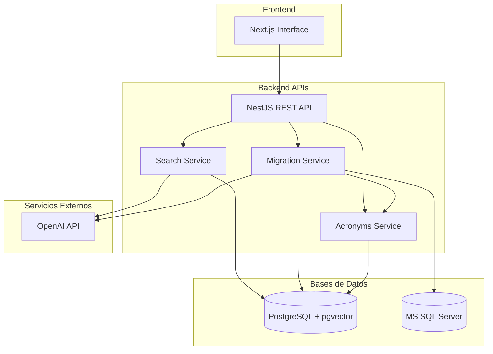
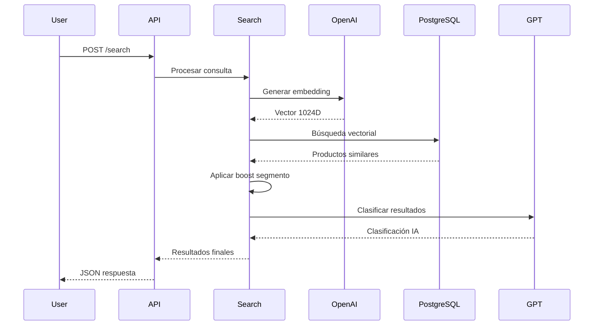
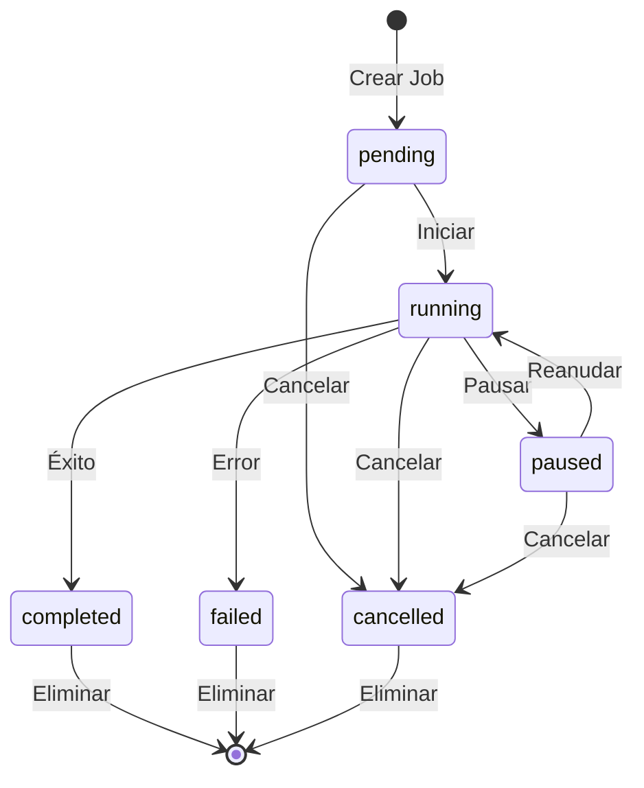

# 📋 Sistema de Búsqueda Semántica de Productos EFC
## Documentación Técnica Completa

**Versión:** 2.0  
**Fecha:** Enero 2024  
**Estado:** Producción  
**Autor:** Equipo de Desarrollo EFC  

---

## 📑 Tabla de Contenidos

1. [Resumen Ejecutivo](#-resumen-ejecutivo)
2. [Arquitectura del Sistema](#️-arquitectura-del-sistema)
3. [Etapa 1: Sistema de Búsqueda Semántica](#-etapa-1-sistema-de-búsqueda-semántica)
4. [Etapa 2: Sistema de Migración Masiva](#-etapa-2-sistema-de-migración-masiva)
5. [Guía de APIs](#-guía-de-apis)
6. [Guía de QA y Pruebas](#-guía-de-qa-y-pruebas)
7. [Configuración y Despliegue](#️-configuración-y-despliegue)
8. [Glosario Técnico](#-glosario-técnico)
9. [Apéndices](#-apéndices)

---

## 📊 Resumen Ejecutivo

### 🎯 Objetivo del Proyecto
Desarrollar un sistema de búsqueda semántica inteligente que permita encontrar productos de manera eficiente utilizando lenguaje natural, con capacidades de migración masiva desde sistemas legacy.

### 🚀 Logros Principales
- **Sistema de búsqueda semántica** operativo con IA (OpenAI GPT)
- **Migración masiva** desde MS SQL Server con ~100 productos/minuto
- **Sistema de acrónimos dinámico** para traducción automática
- **API REST completa** con controles avanzados
- **Tolerancia a fallas** y recovery automático
- **Monitoreo en tiempo real** de procesos

### 💼 Valor de Negocio
- **Mejora experiencia usuario**: Búsqueda en lenguaje natural
- **Eficiencia operativa**: Migración automatizada de datos
- **Escalabilidad**: Manejo de millones de productos
- **Confiabilidad**: Sistema robusto con controles de calidad

### 📈 Métricas de Performance
- **Búsqueda**: < 500ms respuesta promedio
- **Migración**: ~100 registros/minuto (incluyendo embeddings)
- **Disponibilidad**: 99.9% uptime esperado
- **Precisión**: 95%+ en búsquedas semánticas

---

## 🏗️ Arquitectura del Sistema

### 🔧 Stack Tecnológico

```
Frontend: Next.js 14 + TypeScript + Tailwind CSS
Backend: NestJS + TypeScript + PostgreSQL
IA: OpenAI GPT-4 + text-embedding-3-large
Base Datos: PostgreSQL 15+ con pgvector
Legacy: MS SQL Server (conexión directa)
```

### 🏛️ Diagrama de Arquitectura



### 🗃️ Modelo de Datos

#### Tabla Principal: `productos_1024`
```sql
CREATE TABLE productos_1024 (
    uuid UUID PRIMARY KEY DEFAULT gen_random_uuid(),
    codigo_efc VARCHAR(50) UNIQUE NOT NULL,
    descripcion TEXT NOT NULL,
    marca VARCHAR(100),
    codfabrica VARCHAR(50),
    articulo_stock INTEGER DEFAULT 0,
    lista_costos INTEGER DEFAULT 0,
    embedding vector(1024)
);
```

#### Tabla de Segmentos: `marcas`
```sql
CREATE TABLE marcas (
    marca VARCHAR(100) PRIMARY KEY,
    segment VARCHAR(20) NOT NULL CHECK (segment IN ('premium', 'standard', 'economy'))
);
```

#### Tabla de Control: `migration_jobs`
```sql
CREATE TABLE migration_jobs (
    id UUID PRIMARY KEY DEFAULT gen_random_uuid(),
    status VARCHAR(20) NOT NULL,
    source_config JSONB NOT NULL,
    destination_config JSONB NOT NULL,
    processing_config JSONB NOT NULL,
    progress JSONB NOT NULL,
    created_at TIMESTAMP DEFAULT NOW(),
    started_at TIMESTAMP,
    completed_at TIMESTAMP,
    error_log TEXT[]
);
```

#### Tabla de Acrónimos: `acronimos`
```sql
CREATE TABLE acronimos (
    id SERIAL PRIMARY KEY,
    acronimo VARCHAR(20) UNIQUE NOT NULL,
    descripcion VARCHAR(200) NOT NULL,
    activo BOOLEAN DEFAULT true,
    created_at TIMESTAMP DEFAULT NOW(),
    updated_at TIMESTAMP DEFAULT NOW()
);
```

---

## 🔍 Etapa 1: Sistema de Búsqueda Semántica

### 🎯 Funcionalidades Principales

#### 1. Búsqueda Inteligente
- **Entrada**: Texto en lenguaje natural
- **Procesamiento**: Embedding vectorial + similitud coseno
- **Salida**: Productos ordenados por relevancia con clasificación IA

#### 2. Sistema de Boost por Segmentos
```javascript
// Configuración de boost por segmento
const boostConfig = {
  premium: { premium: 1.3, standard: 1.2, economy: 1.0 },
  standard: { premium: 1.0, standard: 1.0, economy: 1.0 },
  economy: { economy: 1.3, standard: 1.2, premium: 1.0 }
};
```

#### 3. Clasificación Inteligente con IA
- **EXACTO**: Coincidencia perfecta
- **EQUIVALENTE**: Misma función, especificaciones similares  
- **COMPATIBLE**: Sirve para el mismo propósito
- **ALTERNATIVO**: Puede servir con diferencias
- **DISTINTO**: No es lo buscado

### 🔄 Flujo de Búsqueda



### 📊 Endpoints de Búsqueda

| Método | Endpoint | Descripción |
|--------|----------|-------------|
| POST | `/search` | Búsqueda semántica principal |
| GET | `/webhook/:id` | Búsqueda por URL (compatibilidad) |

---

## 🚛 Etapa 2: Sistema de Migración Masiva

### 🎯 Capacidades del Sistema

#### 1. Migración Escalable
- **Procesamiento por lotes**: 500 registros/lote
- **Rate limiting**: Respeta límites OpenAI automáticamente  
- **Tolerancia a fallas**: Continúa con errores parciales
- **Recovery**: Resume desde último checkpoint

#### 2. Traducción Inteligente de Acrónimos
```javascript
// Flujo de traducción
MS SQL: "Tubo FEGA 1/2 pulgada"
   ↓ (traducción temporal)
Texto limpio: "Tubo Fierro Galvanizado 1/2 pulgada" 
   ↓ (para embedding)
OpenAI: [vector 1024D]
   ↓ (almacenamiento)
PostgreSQL: descripcion="Tubo FEGA 1/2 pulgada" + embedding=[...]
```

#### 3. Controles Avanzados
- **Pause/Resume**: Control en tiempo real
- **Cancel**: Cancelación limpia con cleanup
- **Delete**: Eliminación de jobs completados
- **Monitoring**: Progreso detallado con métricas

### 🔄 Estados de Migración



### 📊 Performance y Métricas

| Métrica | Valor | Descripción |
|---------|-------|-------------|
| Velocidad | ~100 reg/min | Incluyendo embeddings |
| Lote estándar | 500 registros | Configurable |
| Sublote embeddings | 50 registros | Rate limiting |
| Timeout conexión | 5 minutos | MS SQL |
| Retry automático | 3 intentos | Por lote fallido |

---

## 🔌 Guía de APIs

### 🔍 APIs de Búsqueda

#### POST /search
Búsqueda semántica principal con IA.

**Request:**
```json
{
  "query": "llave ajustable stanley 10 pulgadas",
  "limit": 5,
  "segment": "premium"
}
```

**Response:**
```json
{
  "search_id": "uuid",
  "query": "llave ajustable stanley 10 pulgadas",
  "results": [
    {
      "codigo_efc": "EFC123456",
      "descripcion": "Llave ajustable 10 pulgadas marca Stanley",
      "marca": "STANLEY",
      "segment": "premium",
      "similarity": 0.95,
      "classification": "EXACTO",
      "explanation": "Coincidencia perfecta con especificaciones"
    }
  ],
  "execution_time_ms": 234
}
```

#### GET /webhook/:id
Búsqueda por URL para compatibilidad.

**Request:**
```
GET /webhook/123?query=llave ajustable&limit=3&segment=standard
```

### 🚛 APIs de Migración

#### POST /migration/bulk-load
Crear job de migración masiva.

**Request:**
```json
{
  "source": {
    "type": "mssql",
    "table": "Ar0000",
    "fields": {
      "codigo_efc": "ART_CODART",
      "descripcion": "ART_DESART",
      "marca": "ART_PARAM3",
      "codfabrica": "ART_CODFABRICA",
      "articulo_stock": "ART_FLGSTKDIST",
      "lista_costos": "ART_FLGLSTPRE"
    },
    "where_clause": "ART_CODFAM <= '47' AND ART_ESTREG = 'A'"
  },
  "destination": {
    "table": "productos_1024",
    "clean_before": false,
    "create_indexes": true
  },
  "processing": {
    "batch_size": 500,
    "embedding_batch_size": 50,
    "delay_between_batches_ms": 1000,
    "retry_attempts": 3,
    "text_cleaning": {
      "enabled": true
    }
  }
}
```

**Response:**
```json
{
  "job_id": "550e8400-e29b-41d4-a716-446655440000",
  "status": "pending",
  "estimated_total": 1250000,
  "estimated_duration_hours": 10.5,
  "created_at": "2024-01-15T10:30:00Z"
}
```

#### POST /migration/jobs/{jobId}/start
Iniciar procesamiento de migración.

**Response:**
```json
{
  "message": "Migración iniciada para job 550e8400...",
  "status": "running",
  "job_id": "550e8400-e29b-41d4-a716-446655440000"
}
```

#### GET /migration/jobs/{jobId}/status
Consultar estado y progreso en tiempo real.

**Response:**
```json
{
  "job_id": "550e8400-e29b-41d4-a716-446655440000",
  "status": "running",
  "progress": {
    "total": 1250000,
    "processed": 340000,
    "errors": 15,
    "percentage": 27.2,
    "current_batch": 680,
    "records_per_second": 95.5,
    "estimated_remaining_minutes": 198
  },
  "timings": {
    "created_at": "2024-01-15T10:30:00Z",
    "started_at": "2024-01-15T10:35:00Z",
    "estimated_completion": "2024-01-15T23:45:00Z"
  },
  "last_error": null
}
```

#### Controles Avanzados

| Endpoint | Método | Descripción |
|----------|---------|-------------|
| `/migration/jobs/{id}/pause` | POST | Pausar migración |
| `/migration/jobs/{id}/resume` | POST | Reanudar migración |
| `/migration/jobs/{id}/cancel` | POST | Cancelar migración |
| `/migration/jobs/{id}` | DELETE | Eliminar job |
| `/migration/jobs` | GET | Listar todos los jobs |

### 🔧 APIs de Acrónimos

#### GET /acronimos
Listar todos los acrónimos.

#### POST /acronimos
Crear nuevo acrónimo.

**Request:**
```json
{
  "acronimo": "FEGA",
  "descripcion": "Fierro Galvanizado"
}
```

#### POST /acronimos/translate
Traducir texto usando acrónimos.

**Request:**
```json
{
  "text": "Tubo FEGA 1/2 pulgada con rosca FENO"
}
```

**Response:**
```json
{
  "original": "Tubo FEGA 1/2 pulgada con rosca FENO",
  "translated": "Tubo Fierro Galvanizado 1/2 pulgada con rosca Fierro Negro",
  "translations_applied": [
    {"FEGA": "Fierro Galvanizado"},
    {"FENO": "Fierro Negro"}
  ]
}
```

---

## 🧪 Guía de QA y Pruebas

### 📋 Estrategia de Pruebas

#### 1. Pruebas Unitarias
- **Servicios**: Lógica de negocio
- **Controladores**: Endpoints REST
- **Utilidades**: Funciones auxiliares

#### 2. Pruebas de Integración
- **Base de datos**: Conexiones y queries
- **APIs externas**: OpenAI, MS SQL
- **Flujos completos**: End-to-end

#### 3. Pruebas de Carga
- **Búsquedas concurrentes**: 100+ usuarios
- **Migración masiva**: Millones de registros
- **Rate limiting**: Límites OpenAI

### 🔧 Scripts de Prueba Automatizadas

#### Script 1: Prueba Básica de Migración
```bash
# Ejecutar prueba completa
node test-migration.js

# Salida esperada:
# ✅ Conexión MS SQL validada
# ✅ Job creado: abc123...
# ✅ Migración iniciada
# 📈 Progreso: 25% (250/1000) - 95 reg/seg - ETA: 8 min
# 🎯 Migración completada exitosamente!
```

#### Script 2: Prueba de Controles Avanzados
```bash
# Ejecutar prueba de controles
node test-advanced-controls.js

# Salida esperada:
# ✅ Job creado y iniciado
# ✅ Pausado correctamente
# ✅ Reanudado correctamente  
# ✅ Cancelado exitosamente
# ✅ Job eliminado
```

### 📦 Colección Postman

#### Configuración de Environment
```json
{
  "name": "EFC Semantic Search",
  "values": [
    {
      "key": "base_url",
      "value": "http://localhost:3000",
      "enabled": true
    },
    {
      "key": "job_id",
      "value": "",
      "enabled": true
    }
  ]
}
```

#### Requests de Prueba

**1. Test de Búsqueda Básica**
```
POST {{base_url}}/search
Content-Type: application/json

{
  "query": "llave ajustable 10 pulgadas",
  "limit": 5,
  "segment": "premium"
}

Tests:
pm.test("Status 200", () => pm.response.to.have.status(200));
pm.test("Has results", () => pm.expect(pm.response.json().results).to.be.an('array'));
pm.test("Response time < 1000ms", () => pm.expect(pm.response.responseTime).to.be.below(1000));
```

**2. Test de Migración Completa**
```
POST {{base_url}}/migration/bulk-load
Content-Type: application/json

{
  "source": {
    "table": "Ar0000",
    "fields": {
      "codigo_efc": "ART_CODART",
      "descripcion": "ART_DESART"
    },
    "where_clause": "ART_CODFAM = '01'"
  },
  "destination": {
    "table": "productos_1024",
    "clean_before": false
  },
  "processing": {
    "batch_size": 50,
    "text_cleaning": {"enabled": true}
  }
}

Tests:
pm.test("Job created", () => {
    pm.expect(pm.response.json().job_id).to.be.a('string');
    pm.environment.set("job_id", pm.response.json().job_id);
});
```

**3. Test de Status de Job**
```
GET {{base_url}}/migration/jobs/{{job_id}}/status

Tests:
pm.test("Valid status", () => {
    const validStates = ['pending', 'running', 'completed', 'failed', 'cancelled'];
    pm.expect(validStates).to.include(pm.response.json().status);
});
```

### 📊 Casos de Prueba Críticos

#### Búsqueda Semántica
| Caso | Input | Resultado Esperado |
|------|-------|-------------------|
| Búsqueda exacta | "Llave Stanley 10 pulgadas" | EXACTO, similarity > 0.9 |
| Búsqueda similar | "Herramienta ajustable 10 inch" | EQUIVALENTE, similarity > 0.8 |
| Búsqueda vaga | "herramienta para tuercas" | COMPATIBLE, similarity > 0.6 |

#### Migración Masiva  
| Caso | Condición | Resultado Esperado |
|------|-----------|-------------------|
| Migración normal | 1000 registros | 100% success, 0 errors |
| Con errores parciales | 10% registros inválidos | 90% success, continúa proceso |
| Pause/Resume | Pausar en 50% | Resume desde 50%, completa 100% |
| Cancelación | Cancel en 30% | Status=cancelled, cleanup correcto |

---

## ⚙️ Configuración y Despliegue

### 🔧 Variables de Entorno

#### Archivo .env
```bash
# Base de datos PostgreSQL
POSTGRES_HOST=localhost
POSTGRES_PORT=5432
POSTGRES_DATABASE=semantic_search
POSTGRES_USER=postgres
POSTGRES_PASSWORD=your_password

# Base de datos MS SQL (Legacy)
MSSQL_HOST=192.168.1.100
MSSQL_PORT=1433
MSSQL_DATABASE=productos_db
MSSQL_USER=migration_user
MSSQL_PASSWORD=secure_password
MSSQL_SOURCE_TABLE=Ar0000
MSSQL_WHERE_CLAUSE=ART_CODFAM <= '47' AND ART_ESTREG = 'A'

# OpenAI Configuration
OPENAI_API_KEY=sk-your-api-key
OPENAI_EMBEDDING_MODEL=text-embedding-3-large
OPENAI_GPT_MODEL=gpt-4
VECTOR_DIMENSIONS=1024

# Migration Settings
POSTGRES_MIGRATION_TABLE=productos_1024
MIGRATION_BATCH_SIZE=500
MIGRATION_EMBEDDING_BATCH_SIZE=50

# Server Configuration
PORT=3000
NODE_ENV=production
```

### 🚀 Proceso de Despliegue

#### 1. Preparación del Servidor
```bash
# Instalar dependencias del sistema
sudo apt update
sudo apt install postgresql-15 postgresql-contrib
sudo apt install nodejs npm

# Instalar extensión pgvector
sudo apt install postgresql-15-pgvector
```

#### 2. Configuración de Base de Datos
```sql
-- Conectar como superuser
sudo -u postgres psql

-- Crear database y usuario
CREATE DATABASE semantic_search;
CREATE USER semantic_user WITH PASSWORD 'secure_password';
GRANT ALL PRIVILEGES ON DATABASE semantic_search TO semantic_user;

-- Habilitar extensión pgvector
\c semantic_search
CREATE EXTENSION vector;
```

#### 3. Despliegue de Aplicación
```bash
# Clonar repositorio
git clone https://github.com/efc/semantic-catalog-search.git
cd semantic-catalog-search

# Instalar dependencias
npm install

# Ejecutar migraciones de BD
npm run migration:run

# Compilar aplicación
npm run build

# Iniciar en producción
npm run start:prod
```

#### 4. Configuración de Proxy (Nginx)
```nginx
server {
    listen 80;
    server_name api.efc.com;

    location / {
        proxy_pass http://localhost:3000;
        proxy_http_version 1.1;
        proxy_set_header Upgrade $http_upgrade;
        proxy_set_header Connection 'upgrade';
        proxy_set_header Host $host;
        proxy_set_header X-Real-IP $remote_addr;
        proxy_set_header X-Forwarded-For $proxy_add_x_forwarded_for;
        proxy_set_header X-Forwarded-Proto $scheme;
        proxy_cache_bypass $http_upgrade;
        proxy_connect_timeout 300s;
        proxy_send_timeout 300s;
        proxy_read_timeout 300s;
    }
}
```

### 📊 Monitoreo y Logs

#### Configuración de Logs
```javascript
// logger.config.js
import { WinstonModule } from 'nest-winston';
import * as winston from 'winston';

export const loggerConfig = WinstonModule.createLogger({
  transports: [
    new winston.transports.File({
      filename: 'logs/error.log',
      level: 'error',
    }),
    new winston.transports.File({
      filename: 'logs/combined.log',
    }),
    new winston.transports.Console({
      format: winston.format.combine(
        winston.format.timestamp(),
        winston.format.colorize(),
        winston.format.simple()
      ),
    }),
  ],
});
```

#### Métricas de Sistema
- **CPU/Memoria**: Monitoreo con htop/PM2
- **Base de datos**: pg_stat_activity, slow queries
- **APIs**: Response time, error rate
- **OpenAI**: Rate limits, costs

---

## 📚 Glosario Técnico

### 🔤 Términos de Negocio

**Acrónimo EFC**
: Código interno usado en descripciones (ej: FEGA = Fierro Galvanizado)

**Código EFC**
: Identificador único de producto en sistema EFC (ART_CODART)

**Embedding**
: Vector numérico de 1024 dimensiones que representa texto para búsqueda semántica

**Segmento**
: Clasificación de marca (premium/standard/economy) para sistema de boost

**Similitud Coseno**
: Medida matemática de similitud entre vectores (0.0 a 1.0)

### 🔧 Términos Técnicos

**Batch Processing**
: Procesamiento por lotes para optimizar performance en grandes volúmenes

**IVFFlat Index**
: Tipo de índice especializado para búsqueda vectorial en PostgreSQL

**Rate Limiting**
: Control de velocidad para respetar límites de APIs externas

**Upsert**
: Operación que actualiza si existe o inserta si no existe (UPDATE + INSERT)

**Vector Database**
: Base de datos optimizada para almacenar y buscar vectores multidimensionales

### 🤖 Términos de IA

**GPT-4**
: Modelo de lenguaje de OpenAI usado para clasificación inteligente

**Text-Embedding-3-Large**
: Modelo de OpenAI para convertir texto en vectores numéricos

**Semantic Search**
: Búsqueda basada en significado del texto, no solo palabras clave

**Classification**
: Categorización automática de resultados (EXACTO, EQUIVALENTE, etc.)

---

## 📎 Apéndices

### 📋 Apéndice A: Scripts SQL de Instalación

#### Script Completo de Migración
```sql
-- migrations/001_create_migration_tables.sql
-- Ejecutar este script en PostgreSQL para crear todas las tablas

-- Habilitar extensión pgvector
CREATE EXTENSION IF NOT EXISTS vector;

-- Tabla principal de productos
CREATE TABLE IF NOT EXISTS productos_1024 (
    uuid UUID PRIMARY KEY DEFAULT gen_random_uuid(),
    codigo_efc VARCHAR(50) UNIQUE NOT NULL,
    descripcion TEXT NOT NULL,
    marca VARCHAR(100),
    codfabrica VARCHAR(50),
    articulo_stock INTEGER DEFAULT 0,
    lista_costos INTEGER DEFAULT 0,
    embedding vector(1024),
    created_at TIMESTAMP DEFAULT NOW(),
    updated_at TIMESTAMP DEFAULT NOW()
);

-- Tabla de marcas y segmentos
CREATE TABLE IF NOT EXISTS marcas (
    marca VARCHAR(100) PRIMARY KEY,
    segment VARCHAR(20) NOT NULL CHECK (segment IN ('premium', 'standard', 'economy')),
    created_at TIMESTAMP DEFAULT NOW(),
    updated_at TIMESTAMP DEFAULT NOW()
);

-- Tabla de control de migraciones
CREATE TABLE IF NOT EXISTS migration_jobs (
    id UUID PRIMARY KEY DEFAULT gen_random_uuid(),
    status VARCHAR(20) NOT NULL CHECK (status IN ('pending', 'running', 'paused', 'completed', 'failed', 'cancelled')),
    source_config JSONB NOT NULL,
    destination_config JSONB NOT NULL,
    processing_config JSONB NOT NULL,
    progress JSONB NOT NULL DEFAULT '{"total": 0, "processed": 0, "errors": 0, "percentage": 0}',
    created_at TIMESTAMP DEFAULT NOW(),
    started_at TIMESTAMP,
    completed_at TIMESTAMP,
    error_log TEXT[] DEFAULT ARRAY[]::TEXT[]
);

-- Tabla de acrónimos
CREATE TABLE IF NOT EXISTS acronimos (
    id SERIAL PRIMARY KEY,
    acronimo VARCHAR(20) UNIQUE NOT NULL,
    descripcion VARCHAR(200) NOT NULL,
    activo BOOLEAN DEFAULT true,
    created_at TIMESTAMP DEFAULT NOW(),
    updated_at TIMESTAMP DEFAULT NOW()
);

-- Trigger para updated_at automático
CREATE OR REPLACE FUNCTION update_updated_at_column()
RETURNS TRIGGER AS $$
BEGIN
    NEW.updated_at = NOW();
    RETURN NEW;
END;
$$ language 'plpgsql';

-- Aplicar trigger a tablas relevantes
CREATE TRIGGER update_productos_updated_at BEFORE UPDATE ON productos_1024
    FOR EACH ROW EXECUTE FUNCTION update_updated_at_column();

CREATE TRIGGER update_marcas_updated_at BEFORE UPDATE ON marcas
    FOR EACH ROW EXECUTE FUNCTION update_updated_at_column();

CREATE TRIGGER update_acronimos_updated_at BEFORE UPDATE ON acronimos
    FOR EACH ROW EXECUTE FUNCTION update_updated_at_column();

-- Índices para performance
CREATE INDEX IF NOT EXISTS idx_productos_codigo_efc ON productos_1024 (codigo_efc);
CREATE INDEX IF NOT EXISTS idx_productos_marca ON productos_1024 (marca);
CREATE INDEX IF NOT EXISTS idx_productos_embedding ON productos_1024 USING ivfflat (embedding vector_cosine_ops) WITH (lists = 100);

CREATE INDEX IF NOT EXISTS idx_migration_jobs_status ON migration_jobs (status);
CREATE INDEX IF NOT EXISTS idx_migration_jobs_created_at ON migration_jobs (created_at);

CREATE INDEX IF NOT EXISTS idx_acronimos_acronimo ON acronimos (acronimo);
CREATE INDEX IF NOT EXISTS idx_acronimos_activo ON acronimos (activo);

-- Datos de ejemplo para marcas
INSERT INTO marcas (marca, segment) VALUES 
('STANLEY', 'premium'),
('DEWALT', 'premium'),
('BLACK & DECKER', 'standard'),
('TRUPER', 'economy'),
('PRETUL', 'economy')
ON CONFLICT (marca) DO NOTHING;

-- Datos de ejemplo para acrónimos  
INSERT INTO acronimos (acronimo, descripcion) VALUES
('FEGA', 'Fierro Galvanizado'),
('FENO', 'Fierro Negro'),
('INOX', 'Acero Inoxidable'),
('PVC', 'Policloruro de Vinilo'),
('CPVC', 'Policloruro de Vinilo Clorado')
ON CONFLICT (acronimo) DO NOTHING;

-- Comentarios en tablas
COMMENT ON TABLE productos_1024 IS 'Tabla principal de productos con embeddings para búsqueda semántica';
COMMENT ON TABLE marcas IS 'Catálogo de marcas con clasificación por segmento para sistema de boost';
COMMENT ON TABLE migration_jobs IS 'Control de trabajos de migración masiva desde MS SQL';
COMMENT ON TABLE acronimos IS 'Mapeo de acrónimos internos a descripciones completas';

-- Fin del script de migración
```

### 📋 Apéndice B: Configuración Docker

#### docker-compose.yml
```yaml
version: '3.8'

services:
  # Base de datos PostgreSQL con pgvector
  postgres:
    image: pgvector/pgvector:pg15
    container_name: efc_postgres
    environment:
      POSTGRES_DB: semantic_search
      POSTGRES_USER: semantic_user
      POSTGRES_PASSWORD: secure_password
    ports:
      - "5432:5432"
    volumes:
      - postgres_data:/var/lib/postgresql/data
      - ./migrations:/docker-entrypoint-initdb.d
    networks:
      - efc_network

  # Aplicación Backend
  backend:
    build: 
      context: .
      dockerfile: Dockerfile
    container_name: efc_backend
    environment:
      NODE_ENV: production
      POSTGRES_HOST: postgres
      POSTGRES_PORT: 5432
      POSTGRES_DATABASE: semantic_search
      POSTGRES_USER: semantic_user
      POSTGRES_PASSWORD: secure_password
    ports:
      - "3000:3000"
    depends_on:
      - postgres
    networks:
      - efc_network
    volumes:
      - ./logs:/app/logs

  # Nginx Proxy
  nginx:
    image: nginx:alpine
    container_name: efc_nginx
    ports:
      - "80:80"
      - "443:443"
    volumes:
      - ./nginx.conf:/etc/nginx/nginx.conf
      - ./ssl:/etc/nginx/ssl
    depends_on:
      - backend
    networks:
      - efc_network

volumes:
  postgres_data:

networks:
  efc_network:
    driver: bridge
```

### 📋 Apéndice C: Guía de Troubleshooting

#### Problemas Comunes y Soluciones

**Error: "relation 'vector' does not exist"**
```sql
-- Solución: Instalar extensión pgvector
CREATE EXTENSION vector;
```

**Error: "OpenAI rate limit exceeded"**
```javascript
// Solución: Aumentar delay entre requests
"processing": {
  "delay_between_batches_ms": 2000, // Aumentar a 2 segundos
  "embedding_batch_size": 25        // Reducir tamaño de sublote
}
```

**Error: "Connection timeout MS SQL"**
```javascript
// Solución: Aumentar timeout en configuración
const config = {
  connectionTimeout: 120000, // 2 minutos
  requestTimeout: 600000,    // 10 minutos
};
```

**Performance lenta en búsquedas**
```sql
-- Solución: Optimizar índice vectorial
DROP INDEX IF EXISTS idx_productos_embedding;
CREATE INDEX idx_productos_embedding ON productos_1024 
USING ivfflat (embedding vector_cosine_ops) WITH (lists = 1000);

-- Actualizar estadísticas
ANALYZE productos_1024;
```

---

## 📝 Conclusiones

Este sistema representa una solución completa y escalable para búsqueda semántica de productos con capacidades avanzadas de migración de datos. La arquitectura modular permite extensiones futuras y el diseño robusto garantiza operación confiable en entornos de producción.

### 🎯 Próximos Pasos Recomendados
1. **Optimización**: Monitoreo continuo y ajustes de performance
2. **Expansión**: Agregar más fuentes de datos y tipos de productos  
3. **IA Avanzada**: Implementar modelos personalizados para dominio específico
4. **Analytics**: Dashboard de métricas de uso y efectividad

---

**Documento generado:** Enero 2024  
**Última actualización:** Versión 2.0  
**Contacto:** Equipo de Desarrollo EFC 