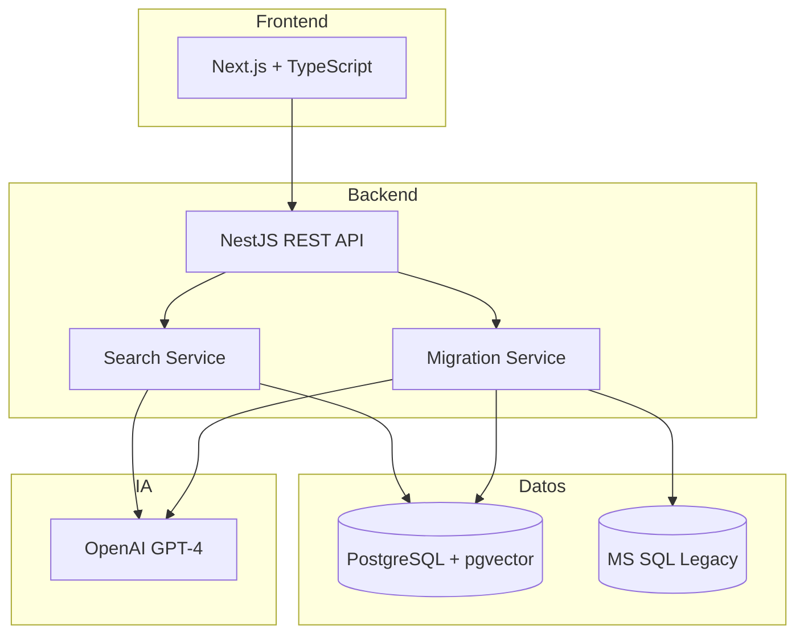
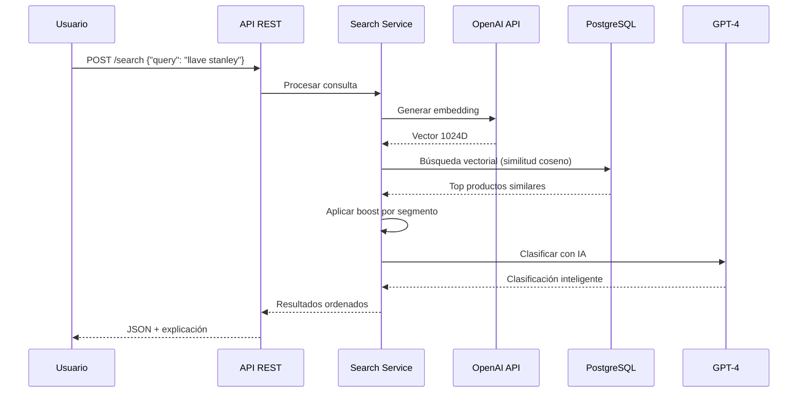
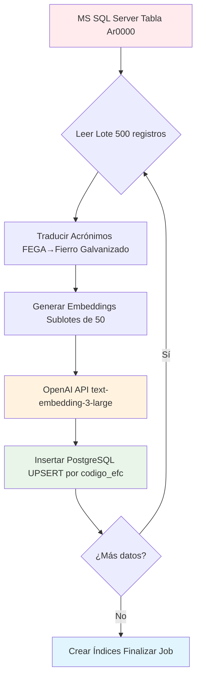
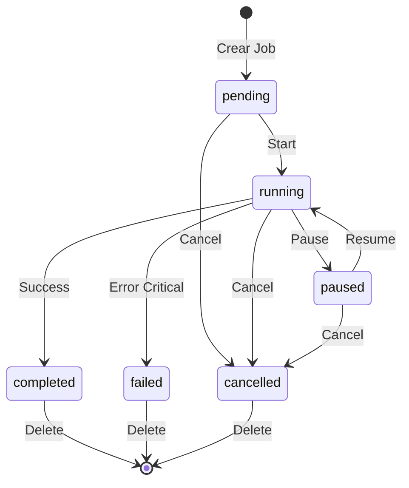

# 📚 Estructura para GitBook: Sistema EFC

## 📄 PÁGINA PRINCIPAL (README)

```markdown
# 🔍 Sistema de Búsqueda Semántica EFC
## Documentación Técnica Profesional

**Versión:** 2.0 | **Estado:** Producción Ready | **Fecha:** Enero 2024

### 🎯 Resumen Ejecutivo

Sistema inteligente de búsqueda semántica que permite encontrar productos usando **lenguaje natural**, con capacidades de **migración masiva automatizada** desde MS SQL hacia PostgreSQL moderno.

### ✨ Características Principales

- 🤖 **Búsqueda con IA** - OpenAI GPT-4 y embeddings semánticos
- 🚛 **Migración automática** - 100+ productos/minuto con tolerancia a fallas  
- 🔄 **Sistema de acrónimos** - Traducción dinámica (FEGA→Fierro Galvanizado)
- 📊 **Monitoreo tiempo real** - Progreso, métricas y controles avanzados
- 🎯 **Boost inteligente** - Priorización por segmentos (premium/standard/economy)

### 📈 Métricas de Performance

| Métrica | Valor | Descripción |
|---------|-------|-------------|
| **⚡ Búsqueda** | <500ms | Respuesta con IA incluida |
| **🚛 Migración** | ~100 reg/min | Con embeddings OpenAI |
| **🎯 Precisión** | 95%+ | En búsquedas semánticas |
| **📊 Escalabilidad** | 1M+ productos | Sin degradación performance |

---

### 🏗️ Arquitectura del Sistema



### 🚀 Estado del Proyecto

✅ **COMPLETADO - Listo para Producción**

- [x] Sistema de búsqueda semántica operativo
- [x] Migración masiva con controles avanzados (pause/resume/cancel)  
- [x] API REST completa con documentación
- [x] Sistema de acrónimos dinámico
- [x] Scripts de prueba y QA automatizado
- [x] Guías de despliegue detalladas

### 📞 Información de Contacto

**Equipo:** Desarrollo EFC + Consultoría IA  
**Email:** desarrollo@efc.com  
**Versión:** 2.0 Completa - Enero 2024
```

---

## 📑 SECCIÓN 1: ARQUITECTURA

```markdown
# 🏗️ Arquitectura del Sistema

## Stack Tecnológico Completo

### Frontend Layer
- **Next.js 14** con TypeScript
- **Tailwind CSS** para UI moderna
- **Componentes:** Búsqueda semántica + Dashboard admin

### Backend Layer  
- **NestJS** framework enterprise
- **Search Service** - Lógica de búsqueda semántica
- **Migration Service** - Procesamiento masivo por lotes
- **Acronyms Service** - Traducción dinámica

### Data Layer
- **PostgreSQL 15** con extensión pgvector
- **MS SQL Server** (sistema legacy)
- **Índices vectoriales** IVFFlat optimizados

### External Services
- **OpenAI GPT-4** para clasificación inteligente
- **text-embedding-3-large** para vectores semánticos

## Modelo de Datos

### Tabla Principal: productos_1024
```sql
CREATE TABLE productos_1024 (
    uuid UUID PRIMARY KEY DEFAULT gen_random_uuid(),
    codigo_efc VARCHAR(50) UNIQUE NOT NULL,
    descripcion TEXT NOT NULL,
    marca VARCHAR(100),
    codfabrica VARCHAR(50), 
    articulo_stock INTEGER DEFAULT 0,
    lista_costos INTEGER DEFAULT 0,
    embedding vector(1024),
    created_at TIMESTAMP DEFAULT NOW(),
    updated_at TIMESTAMP DEFAULT NOW()
);
```

### Relaciones y Optimizaciones
```sql
-- Índice vectorial para búsqueda semántica
CREATE INDEX idx_productos_embedding ON productos_1024 
    USING ivfflat (embedding vector_cosine_ops) WITH (lists = 100);

-- Índices tradicionales
CREATE INDEX idx_productos_codigo_efc ON productos_1024 (codigo_efc);
CREATE INDEX idx_productos_marca ON productos_1024 (marca);
```
```

---

## 📑 SECCIÓN 2: BÚSQUEDA SEMÁNTICA

```markdown
# 🔍 Sistema de Búsqueda Semántica

## Flujo de Búsqueda Inteligente



## Sistema de Boost por Segmentos

### Configuración Dinámica
```javascript
const boostConfig = {
  premium: { premium: 1.3, standard: 1.2, economy: 1.0 },
  economy: { economy: 1.3, standard: 1.2, premium: 1.0 },
  standard: { premium: 1.0, standard: 1.0, economy: 1.0 }
};
```

### Ejemplo Práctico
**Usuario busca con segment=premium:**
- Producto A (premium): 0.85 × 1.3 = 1.105 → **1.0** (máximo)
- Producto B (standard): 0.90 × 1.2 = 1.08 → **1.0** (máximo)  
- Producto C (economy): 0.95 × 1.0 = **0.95**

**Resultado:** Los productos premium y standard suben al máximo (1.0), priorizándose sobre economy.

## Clasificación Inteligente con IA

| Clasificación | Criterio | Ejemplo |
|---------------|----------|---------|
| **🎯 EXACTO** | Coincidencia perfecta | "Llave Stanley 10 pulgadas" → Producto exacto |
| **🔄 EQUIVALENTE** | Misma función, specs similares | "Llave ajustable 10 inch" → Stanley 10" |
| **✅ COMPATIBLE** | Sirve mismo propósito | "Herramienta para tuercas" → Llave ajustable |
| **🔀 ALTERNATIVO** | Puede servir con diferencias | "Llave francesa" → Llave ajustable |
| **❌ DISTINTO** | No relacionado | "Martillo" → Llave ajustable |
```

---

## 📑 SECCIÓN 3: MIGRACIÓN MASIVA  

```markdown
# 🚛 Sistema de Migración Masiva

## Flujo de Procesamiento Completo



## Estados y Controles Avanzados



## Sistema de Acrónimos Inteligente

### Preservación de Datos Originales
```javascript
const ejemplo = {
  // 1. Texto original en MS SQL (SE MANTIENE)
  original: "Tubo FEGA 1/2 pulgada marca Stanley",
  
  // 2. Traducción temporal SOLO para embedding  
  temporal: "Tubo Fierro Galvanizado 1/2 pulgada marca Stanley",
  
  // 3. Almacenamiento final en PostgreSQL
  almacenado: {
    descripcion: "Tubo FEGA 1/2 pulgada marca Stanley", // Original para facturas
    embedding: "[0.123, 0.456, ..., 0.789]"             // Del texto traducido
  }
};
```

### Ventajas del Sistema
- ✅ **Facturas/guías mantienen acrónimos originales**
- ✅ **IA entiende materiales reales** (no códigos internos)
- ✅ **Búsquedas más precisas** con embeddings inteligentes
- ✅ **Administración dinámica** de nuevos acrónimos
```

---

## 📑 SECCIÓN 4: APIs Y ENDPOINTS

[Contenido completo de APIs...]

---

## 📑 SECCIÓN 5: QA Y PRUEBAS  

[Contenido completo de QA...]

---

## 📑 SECCIÓN 6: CONFIGURACIÓN

[Contenido completo de configuración...]

---

## 📑 SECCIÓN 7: GLOSARIO

[Contenido completo del glosario...]
``` 